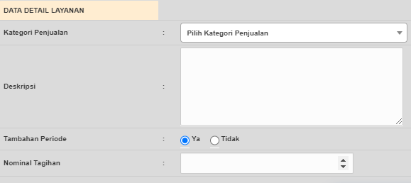
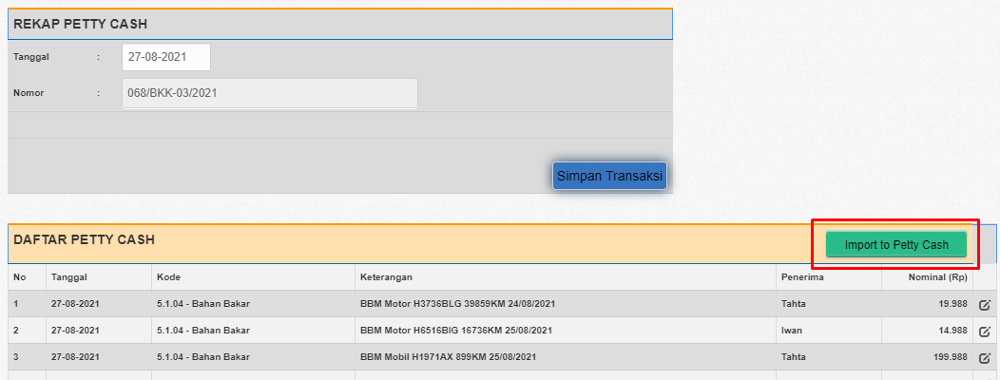

# 1 Data Client

**Admin** bertanggung jawab mengelola data client baik menambahkan client baru maupun mengedit data client. Data Client berguna untuk pembuatan [**Invoice**](#2-invoice)

**Database yang digunakan :** ***client** , **client_pkt***

## 1.1 Create Client

Untuk menambahkan **Data Client** bisa masuk ke **Data Master** :arrow_right: **Client** :computer_mouse: **Add Data** . Data yang perlu dipersiapkan * : 

1. Kode Client : diisi dengan Huruf Besar dan angka, dapat diisi 3 - 6 Karakter

2. Status : diisi aktif jika client masih aktif

3. Nama Client : diisi dengan nama client, untuk penggunaan simbol hanya diperbolehkan menggunakan [  **+ , . - ( )** ]

4. Keterangan : 
   1. **Client Bulanan** (Untuk client yang ditagih secara bulanan)
   2. Client Onetime (Untuk client yang ditagih secara onetime)
   3. Client Titipan (Client Titipan berguna untuk Ticketting Helpdesk)
   4. BTS (Digunakan untuk Ticketting Helpdesk)
   
5. **Alamat Lengkap** : diisi alamat client

6. Data PIC Client (Nama) : diisi nama PIC Client

7. Data PIC Client (No. Telepon) : diisi no telpon PIC client 

8. Data Admin (Marketting in charge) : diisi nama marketting

9. Data Admin (Tanggal MOU) : diisi tanggal MOU untuk client baru maka Tanggal MOU dan Tanggal Berlangganan sama

10. Data Admin (Waktu Kontrak) : diisi waktu kontrak dalam hitungan bulan

11. Data Lainnya (Alamat Pengiriman) : diisi jika alamat pengiriman pada invoice berbeda dengan [alamat lengkap](#11-create-client). untuk format penuliasannya **NamaClient#Alamat Pengiriman**. Contohnya 

    > Alamat Pengiriman : Kantor Dinas Perhubungan Semarang#Jl. Mekar Sari No. 20

## 1.2 Edit Client

Untuk mengedit **Data Client** bisa masuk ke **Data Master** :arrow_right: **Client** :pencil:**Edit Client**  . Data tambahan yang di edit yaitu :

1.  No. Urut Invoice Auto : diisi angka lebih dari 0, sesuaikan dengan urutan Invoice Auto yang akan dicetak (angka boleh sama).

2. Data Detail Layanan : Diinput untuk client dengan keterangan **Client Bulanan** . 

    

   1. Kategori Penjualan diisi sesuai ketentuan berikut ini :
      1.	BANDWIDTH : UNTUK TAGIHAN BANDWIDTH BULANAN
      2.	INSREG : HANYA UNTUK INSTALASI KLIEN BULANAN
      3.	LAIN2 :
         1.	ANNUAL FEE (UNTUK KLIEN DU SMRG)
         2.	JASA ONE TIME (PENARIKAN KABEL, SETTING AKSES POINT, SETTING RADIO, SETTING CCTV)
      4.	COLOCATION : COLOCATION SERVER / ANTENA (ADA KLIEN YANG MENITIPKAN PERANGKATNYA DI LAHAN DU)
      5.	DOMAIN/HOSTING : BIAYA DOMAIN (TAHUNAN), HOSTING (BULANAN)
      6.	IP : SEWA IP ADDRESS
      7.	INFRASTRUKTUR :
         1.	PEMBELIAN PERANGKAT SEKALIGUS DENGAN JASANYA YANG SIFATNYA ONE TIME, MISALNYA : ADA PEMBANGUNAN JARINGAN LOKAL LAN DI SEBUAH HOTEL, DATAUTAMA MENJUAL PERANGKAT SEKALIGUS JASA PENARIKAN KABELNYA.
         2.	SEWA INFRASTRUKTUR (UNTUK KLIEN DU SMG-MSM)
      8.	PERANGKAT : JIKA HANYA MENJUAL PERANGKATNYA SAJA, TANPA JASA SETTING DLL.
   2. Deskripsi : input keterangan
   3. Tambahan Periode : Pilih **YA** , jika Deskripsi ada keterangan Periode Tanggal
   4. Nominal Tagihan : diisi tagihan sebelum PPN

   

# 2 Invoice

**Admin** bertanggung jawab membuat Invoice Bulanan maupun Onetime. 

Database yang digunakan invoice auto dan invoice baru : **invoice, invoice_item, glj, glj_item, saldo_client**

Database yang digunakan Pembayaran Invoice : **tmp_bayar_invoice (temporary) , glj, glj_item, saldo_client, bk_bank, bayar_invoice, bayar_invoice_item**

## 2.1 Invoice Auto

Lokasi dari Invoice Auto : **Transaksi :arrow_right:  Penjualan :arrow_right:  Invoice Auto** 

Invoice Auto merupakan fitur baru dari Backoffice untuk mempercepat pembuatan invoice bulanan secara automatis, pembuatannya mulai H-4 sampai H+3 di bulan berjalan Invoice dan  dengan syarat Client :

1. Client memiliki 1 Invoice sebelumnya. Digunakan untuk mengambil data kode faktur 
2. Termasuk Client Bulanan
3. Client Valid : Sisa Kontrak dan Layanan ada

## 2.2 Invoice Baru

Lokasi dari Invoice Baru : **Transaksi** :arrow_right: **Penjualan** :arrow_right: **Invoice Baru** :fast_forward: **pilih Client**  

Invoice Baru bisa digunakan untuk Penjualan Onetime maupun Bulanan jika tidak dapat menggunakan Invoice Auto

------

**Jurnal Yang terbentuk dari Invoice Auto dan Invoice Baru** :

Jenis Jurnal yang dipakai  **INV**

| AKUN           |      DEBET |     KREDIT |
| -------------- | ---------: | ---------: |
| PIUTANG DAGANG | 11.010.000 |            |
| PENJUALAN *    |            | 10.000.000 |
| HUTANG PPN     |            |  1.000.000 |
| METERAI        |            |     10.000 |

## 2.3 Pembayaran Invoice

Lokasi dari Pembayaran Invoice : **Transaksi** :arrow_right: **Penjualan** :arrow_right: **Pembayaran Invoice** :fast_forward: **pilih Client**  

Digunakan untuk melunasi invoice client ketika client sudah membayar invoice tersebut. Jika client hanya membayar sebagian maka pilih **Bayar Sebagian** dan isi nominal serta potongan jika ada.

*Kondisi Khusus misal Client PT. ABC double bayar di bulan Agustus untuk Invoice Agustus. Client minta Kelebihan bayar digunakan untuk Pembayaran Invoice September. Saat membayar Invoice September pilih Bank dengan nama **Uang Muka Penjualan** tanggal disesuaikan dengan Invoice September.

###### *Perhatian !!!* 

​	Untuk Pembayaran tolong sesuaikan dengan nominal pembayaran real di Bank, misal pembayaran dibank sebesar 11.010.000 maka hasil akhir pembayaran juga harus sesuai seperti gambar dibawah ini

------

**Berikut Jurnal Jenis -  Jenis Pembayaran Invoice :**

Jenis Jurnal yang dipakai  **BIN**

### 2.3.1 Pembayaran Full

| AKUN           |      DEBET |     KREDIT |
| -------------- | ---------: | ---------: |
| BANK           | 11.010.000 |            |
| PIUTANG DAGANG |            | 11.010.000 |

### 2.3.2 Pembayaran dengan Potongan Meterai

| AKUN           |      DEBET |     KREDIT |
| -------------- | ---------: | ---------: |
| BANK           | 11.000.000 |            |
| BIAYA LAIN2    |     10.000 |            |
| PIUTANG DAGANG |            | 11.010.000 |

### 2.3.3 Pembayaran dengan PPh 23

Jika PPh 23 tidak sesuai dapat menggunakan Custom Nominal PPh dan tetap ceklist PPh 23

| AKUN             |      DEBET |     KREDIT |
| ---------------- | ---------: | ---------: |
| BANK             | 10.810.000 |            |
| UM. PPh Pasal 23 |    200.000 |            |
| PIUTANG DAGANG   |            | 11.010.000 |

### 2.3.4 Pembayaran dengan biaya lain-lain maupun biaya tranfer

| AKUN           |      DEBET |     KREDIT |
| -------------- | ---------: | ---------: |
| BANK           | 11.005.000 |            |
| BIAYA LAIN2    |      5.000 |            |
| PIUTANG DAGANG |            | 11.010.000 |

### 2.3.5 Pembayaran dengan Diskon Penjualan

| AKUN             |      DEBET |     KREDIT |
| ---------------- | ---------: | ---------: |
| BANK             | 10.010.000 |            |
| DISKON PENJUALAN |  1.000.000 |            |
| PIUTANG DAGANG   |            | 11.010.000 |

### 2.3.6 Pembayaran dengan PPh 4 Ayat 2

| AKUN           |      DEBET |     KREDIT |
| -------------- | ---------: | ---------: |
| BANK           | 10.010.000 |            |
| UM. PPh Final  |  1.000.000 |            |
| PIUTANG DAGANG |            | 11.010.000 |

### 2.3.7 Pembayaran dengan PPh 22

| AKUN             |      DEBET |     KREDIT |
| ---------------- | ---------: | ---------: |
| BANK             | 10.860.000 |            |
| UM. PPh Pasal 22 |    150.000 |            |
| PIUTANG DAGANG   |            | 11.010.000 |

## 2.4 Laporan

Lokasi : **Laporan** :arrow_right: **Penjualan**  

Laporan yang terbuat dari transaksi invoice maupun pembayaran invoice : 

### 2.4.1 Laporan Invoice

Untuk mencetak laporan 1 Invoice menggunakan **Laporan Invoice**, sedangkan untuk **Laporan Invoice Periode** dapat mencetak laporan lebih dari satu dengan syarat per invoice 1 halaman.

Data diambil dari database **invoice dan invoice_item** 

### 2.4.2 Laporan Pembayaran Invoice

Berisi Daftar Pembayaran Invoice beserta informasi Bank

Ambil dari database **bayar_invoice , bayar_invoice_item , bk_bank**

### 2.4.3 Laporan Piutang Dagang

Berisi Piutang Dagang per Client yang diambil dari **saldo_client**.  Untuk Saldo Awal mulai 2021 diambil dari database **client** 

Data Laporan diambil dari database **saldo_client , bk_bank , client**

### 2.4.4 Laporan Piutang Periode

Berisi Detail Layanan Invoice dan Pembayaran Invocie yang diambil dari database **saldo_client**. Bisa filter berdasarkan periode tanggal invoice.

### 2.4.5 Saldo Piutang Dagang

Berisi informasi Saldo Akhir Client yang dapat ditentukan tanggal saldo akhirnya. Informasi juga dapat diexport ke Excel.

Data Laporan diambil dari database **saldo_client** dan **client**

### 2.4.6 Laporan Invoice Monthly

Berisi informasi Invoice Bulanan yang dapat dicetak **PDF** maupun export **Excel**

Data diambil dari database **invoice** dan **client** 

# 3 PETTY CASH

Ketentuan Input Petty Cash :

- Jika ada pembelian Perangkat yang merupakan Jenis Inventaris misal beli **Mikrotik powerline PL 7411** di tokped seharga 660.000 ongkir 10.000 maka saat pembuatan petty cash itu dipisah yang mikrotik dengan kode Inventaris Perangkat 660.000 , Sedangkan ongkir masukkan ke Kode Ekspedisi
- Jika ada Pembayaran Biaya Tenaga Ahli atau yang berhubungan dengan pajak misal sebesar 12.000.000, dipotongkan untuk PPh 21 sebesar 2.5% hingga 3% atau 300.000. Yang diinput di **Input Petty Cash**  sebesar 11.700.000 dengan kode Biaya Tenaga Ahli. Sedangkan 300.000 diinput di [**Hutang Pajak**](#33-hutang-pajak) untuk debet (**Biaya Tenaga Ahli**) dan kreditnya (**Hutang PPh 21**) 

## 3.1 Input Petty Cash

Lokasi : **Petty Cash :arrow_right: Input** 

Digunakan admin untuk input petty cash data tersebut masuk ke Database (sebelum rekap transaksi) **tmp_pcash**. Setelah semua data dicek selanjutnya direkap transaksi untuk menjadikan sebuah laporan. 

------

Data tersebut masuk ke Database : **saldo_pcash, pcash, pcash_item, glj, glj_item**

Jenis Jurnal yang dipakai  **PET** , untuk pusat menggunakan **PET-PST**

Jurnal yang terbentuk dari Petty Cash tersebut

| AKUN                |   DEBET |  KREDIT |
| ------------------- | ------: | ------: |
| Administrasi Kantor | 100.000 |         |
| Bahan Bakar         |  15.000 |         |
| KAS KECIL           |         | 115.000 |

## 3.2 TopUp Petty Cash

Lokasi : **Petty Cash :arrow_right:  Top-up** 

Top Up Saldo Petty Cash sesuaikan TopUp bank. Pastikan Saldo Petty Cash Sesuai dengan Saldo Real. History TopUp yang ditampilkan 40 item.

------

Database yang digunakan  : **bk_bank, saldo_pcash, glj, glj_item**  

Jenis Jurnal yang dipakai  **TOP** , untuk pusat menggunakan **TOP-PST**

Jurnal yang terbentuk dari Petty Cash tersebut

| AKUN       |   DEBET |  KREDIT |
| ---------- | ------: | ------: |
| Petty Cash | 100.000 |         |
| Bank       |         | 100.000 |

## 3.3 Hutang Pajak

Seperti yang dijelaskan pada contoh kasus [Petty Cash](#3-petty-cash) di atas . Input Hutang Dagang Pajak Petty Cash digunakan untuk potongan PPh. 

Database yang digunakan : **glj, glj_item**

Jenis jurnal yang digunakan : **PPH-PC**

## 3.4 Laporan Petty Cash

Lokasi : **Laporan :arrow_right: Petty Cash**

Laporan yang terbentuk pada transakasi Petty Cash  :

### 3.4.1 Mutasi Petty Cash 

Yang ditampilkan mutasi Petty Cash debet dan kredit

Data diambil dari Database : **saldo_pcash**

### 3.4.2 Petty Cash

Menampilkan Item dari Petty Cash yang dapat di Export Excel untuk laporan bulanan.

Database yang digunakan : **pcash_item**

### 3.4.3 Cetak Petty Cash

Menampilkan Laporan Rekap Petty Cash. Selain itu khusus Petty Cash terakhir jika Petty Cash tersebut ada revisi baik penambahan / pengurangan item. maka dapat klik **Import to Petty Cash** sehingga program automatis menyalin item pada rekap yang dipilih ke **Input Petty Cash** selanjutnya Petty Cash yang dipilih dihapus (fungsinya agar **No BKK** dapat digunakan lagi).

# 4 Pembeliaan

hal dasar yang perlu diketahui: 

##### Daftar Cabang  : 

1. JKT : Jakarta
2. SBY : Surabaya
3. SMG : Semarang
4. SLO : Solo
5. TBN : Tuban

##### Kategori Barang :

1. Bandwidth : Kategori untuk barang berupa Layanan Internet, khusus badwidth satuan yang dipilih adalah **bundle**

2. Akuntan & Konsultan : Kategori Supplier Jasa Akuntan & Konsultan

3. Asuransi Cabang: Kategori Asuransi yang merupakan Amortisasi

4. Sewa Cabang: Kategori Sewa yang merupakan Amortisasi

5. HPPJ : Kategori HPP khusus Jasa

6. LTAT : Kategori Listrik, Air & Telpon Bulanan

7. Barang awalan IV-1 (IV-1 , 1 untuk urutan cabang Jakarta) : Kategori Barang yang merupakan **INVENTARIS** . Barang yang termasuk Inventaris nanti juga diinput **Fix Asset Baru**. Barang yang dibeli pembayarannya lewat Petty Cash juga Input **Fix Asset Baru**

8. Barang awalan PR-1 (PR-1, 1 untuk urutan cabang Jakarta) : Kategori Barang yang merupakan **PERSEDIAAN** (Termasuk barang **Stok**)

   *Jika barang belum tersedia di list dapat request ke **Finance**

9. Barang langsung kode barangnya : Kategori Barang yang akan dijual kembali ke Client

## 4.1 Purchase Order

Lokasi di **Transaksi :arrow_right: Pembeliaan :arrow_right: Purchase Order & Pembeliaan :computer_mouse:   klik simbol :heavy_plus_sign:**

Untuk membuat transaksi Purchase Order.

Database Temporary ketika **Isi Transaksi** belum di simpan : **tmp_poitem**

Database yang digunakan: **po dan po_item ** 

## 4.2 Pembeliaan

Lokasi di **Transaksi :arrow_right: Pembeliaan :arrow_right: Purchase Order & Pembeliaan :computer_mouse: klik simbol :briefcase:**

Untuk menginput transaksi Pembeliaan. Yang dipersiapkan untuk input pembeliaan:

1. No Invoice : sesuaikan dengan no invoice pada tagihan, jika Tagihan Gabungan maka no invoice tambahkan kode cabangnya misal no invoice INV00900SMG untuk cabang Semarang. Jika memang tagihan tidak ada no invoice maka dikosongin saja.
2. Tanggal Invoice : Tanggal Tagihan Invoice
3. Meterai : Input meterai jika ada. Jika Invoice Gabungan maka meterai ditagihkan untuk Cabang Jakarta.
4. PPN : Jika Tagihan tanpa PPN maka input 0
5. Tambahkan Isi Transaksi: 
   1. Pilih Barang :  informasi detail di [Kategori Barang](#kategori-barang-)
   2. Jumlah : Isi jumlah barang
   3. Harga : Harga Satuan
6. Setelah isi transaksi sudah dikirim, Klik Simpan

------

Database Temporary ketika **Isi Transaksi** belum di simpan : **i_tmp_trans**

Database yang digunakan: **i_master_trans , i_detail_trans ,  i_stok (jika termasuk barang stok) , glj , glj_item , saldo_supplier**

Jenis Jurnal yang dipakai : **TAG**

Jurnal yang terbentuk dari Pembeliaan misalnya pembeliaan Perangkat **Inventaris**

| AKUN                       |     DEBET |    KREDIT |
| -------------------------- | --------: | --------: |
| Inventaris Perangkat *     | 6.000.000 |           |
| Hutang PPN **jika ber-PPN* |   600.000 |           |
| Meterai                    |    10.000 |           |
| Hutang Dagang              |           | 6.610.000 |

## 4.3 Pembayaran Tagihan

Lokasi di **Transaksi :arrow_right: Pembeliaan :arrow_right: Pembayaran Tagihan :computer_mouse:   klik simbol :heavy_plus_sign:**

Digunakan untuk melunasi Tagihan ketika Datautama sudah membayar tagihan tersebut. Jika Datautama hanya membayar sebagian maka pilih **Bayar Sebagian** dan isi nominal serta potongan jika ada.

Cara Input Pembayaran :

1. Input Tanggal Bayar , sesuaikan dengan Tanggal Pembayaran di bank.

2. Bank : Pilih Bank sesuai pembayaran,  kondisi Khusus Pembayaran: 
   1. Jika ada Tagihan Pembeliaan yang biasanya dibayar lewat bank dan sudah input  [Tagihan Pembeliaan](#42-pembeliaan) maka pilih Kas Kecil.
   2. Jika Bulan Lalu Datautama double bayar, kelebihan bayarnya dijadikan **Uang Muka Pembeliaan** maka Bank yang dipilih **Uang Muka Pembeliaan**. Dan untuk tanggal disesuaikan dengan Tagihan Pembeliaan.
   
3. Pilih Invoice yang akan dibayar , beberapa jenis pembayaran :

   1. Full Pembayaran tanpa potongan

      Jurnal yang terbentuk

      | AKUN          |     DEBET |    KREDIT |
      | ------------- | --------: | --------: |
      | Hutang Dagang | 1.100.000 |           |
      | Bank          |           | 1.100.000 |

   2. Pembayaran dengan PPh 

      PPh yang tersedia (PPh 23, PPh 4, PPh 26) Pilih PPh yang akan dipakai , jika nominal tidak diisi maka automatis program yang menghitung nominal pph , dan jika hasil pph tidak sesuai maka dapat input secara manual.

      Jurnal yang terbentuk

      | AKUN          |     DEBET |    KREDIT |
      | ------------- | --------: | --------: |
      | Hutang Dagang | 1.100.000 |           |
      | Bank          |           | 1.080.000 |
      | Hutang PPh 23 |           |    20.000 |

   3. Pembayaran disertai Potongan Pembeliaan

      Potongan pembeliaan biasanya dipakai ketika Datautama tidak bayar Meterai atau lainnya nominal dibawah 10.000 . Kasus lain ketika Tagihan Invoice 1.100.001,99 tetapi Datautama hanya membayar 1.100.000 , maka 1,99 rupiahnya masukan ke Potongan Pembeliaan. 

      Sedangkan jika Tagihannya 1.099.999 tetapi Datautama membayar sebesar 1.100.000 maka yang diinput di Pembayaran Tagihan sebesar 1.099.999 sedangkan 1 Rupiahnya di Input ke [Input Transaksi Buku Bank](#52-input-transaksi-buku-bank) 

      Jurnal yang terbentuk

      | AKUN                |     DEBET |    KREDIT |
      | ------------------- | --------: | --------: |
      | Hutang Dagang       | 1.099.999 |           |
      | Bank                |           | 1.099.999 |
      | Potongan Pembeliaan |           |         1 |

4. Setelah itu klik Tambah, untuk menambahkan invoice yang akan dibayarkan

5. Sesuaikan nominal akhir pembayaran tidak boleh ada selisih 0.01 karna dapat membuat saldo bank selisih.

Jenis Jurnal yang dipakai : **BTG**

Database Temporary ketika **Isi Transaksi** belum di simpan : **tmp_bayar_hutang**

Database yang digunakan : **saldo_supplier , bk_bank , bayar_hutang , bayar_hutang_item , i_master_trans , glj , glj_item**

## 4.4 Laporan

Lokasi : **Laporan** :arrow_right: **Pembeliaan**  

Laporan yang terbuat dari transaksi invoice maupun pembayaran invoice : 

### 4.4.1 Purchase Order

Berisi Laporan Purchase Order yang telah dibuat. Admin hanya dapat mengubah nominal barang , tanggal , ppn pada Laporan.

Data diambil dari database **po dan po_item** 

### 4.4.2 Laporan Pembeliaan

Berisi Laporan yang telah dibuat. Admin hanya dapat mengedit nomor faktur. Jika terjadi kesalahan admin menginput ulang Pembeliaan. Dengan syarat Pembayaran dari Pembeliaan tersebut **sudah dihapus terlebih dahulu**

Ambil dari database **i_master_trans dan supplierdu**

### 4.4.3 Laporan Pembayaran Tagihan

Berisi Laporan yang telah dibuat. Admin hanya dapat menghapus Data Pembayaran Tagihan.

Data Laporan diambil dari database **saldo_supplier, bk_bank , bayar_hutang , bayar_hutang_item , glj , glj_item , i_master_trans**

### 4.4.4 Laporan Hutang Dagang

Berisi Tagihan dan Pembayaran yang diambil dari database **saldo_supplier dan bk_bank**. Saldo awal diambil dari Database **saldo_supplier** dengan keterangan  kolom **kode** = "sal_awal"

### 4.4.5 Saldo Piutang Dagang

Berisi informasi Saldo Akhir Supplier yang dapat ditentukan tanggal saldo akhirnya. Informasi juga dapat diexport ke Excel.

Data Laporan diambil dari database **saldo_supplier** dan **supplierdu**

# 5 Bank

Lokasi : **Bank** 

## 5.1 Cek Input Bank

Berisi Detail Transaksi Bank yang berupa Data Excel. Digunakan untuk cek Nominal Bank Backoffice dengan Bank Excel.

Data Laporan diambil dari database **glj_item** 

## 5.2 Input Transaksi Buku Bank

Pilih Bank terlebih dahulu 

Beberapa Kasus Transaksi :

1. Ketika Input Transaksi **Pembayaran Tagihan** , misal Tagihannya 1.099.999 tetapi Datautama membayar sebesar 1.100.000 maka yang diinput di Pembayaran Tagihan sebesar 1.099.999 sedangkan 1 Rupiahnya diinput dengan 
   1. Kode : **Biaya Lain2** 
   2. Keterangan : Sesuai Keterangan di Bank Excel
   3. Jenis Kas : Kredit , karena Uang Keluar dari Bank
   4. Nominal : 1
2. Ketika Input Transaksi **Pembayaran Invoice** client ,  misal Nominal Invoice 1.000.000 tetapi Client membayar sebesar 1.000.100 maka 100 rupiah diinput disini *Jika nominal 10.000 atau dibawahnya masukkan sebagai **Pendapatan Lain2**
   1. Kode : **Pendapatan Lain2**
   2. Keterangan : Sesuai Keterangan di Bank Excel
   3. Jenis Kas : Debet, Karena Uang Masuk Ke Bank
   4. Nominal : 100
3. Ketika Input Transaksi **Pembayaran Invoice** client, ternyata client membayar double bayar. Client setuju untuk pembayaran kedua diinput sebagai **Uang Muka Penjualan**. 
   1. Kode : **Uang Muka Penjualan**
   2. Keterangan : Sesuai Keterangan di Bank Excel
   3. Jenis Kas : Debet, Karena Uang Masuk Ke Bank
   4. Nominal : nominal tagihan

# 6 Inventaris

Inventaris adalah barang yang tidak dipergunakan untuk dijual dan harganya diatas 250.000 kecuali kabel. 

Barang Inventaris baik pembelian melalui Bank Maupun Kas Kecil harus diinput di Fix Asset.

## 6.1 Fix Asset

