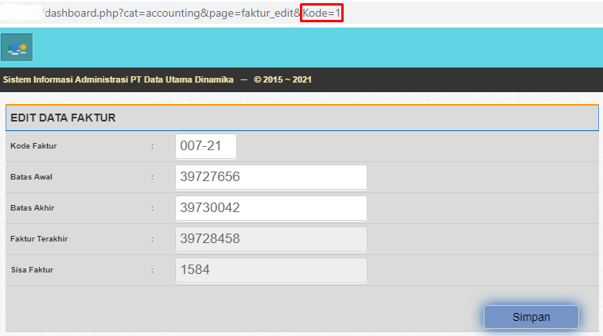
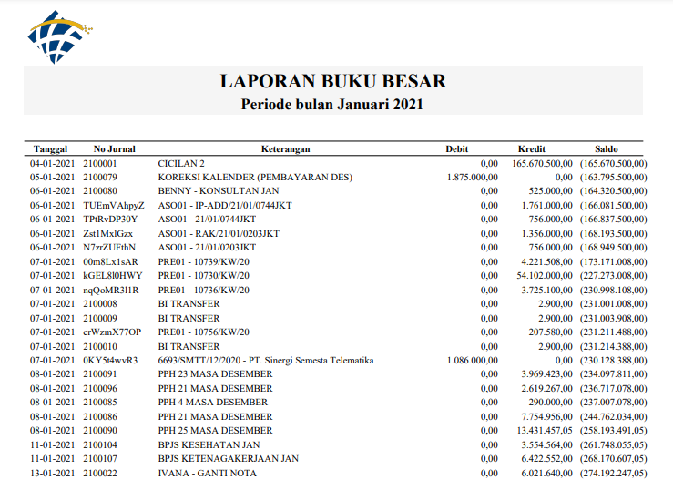
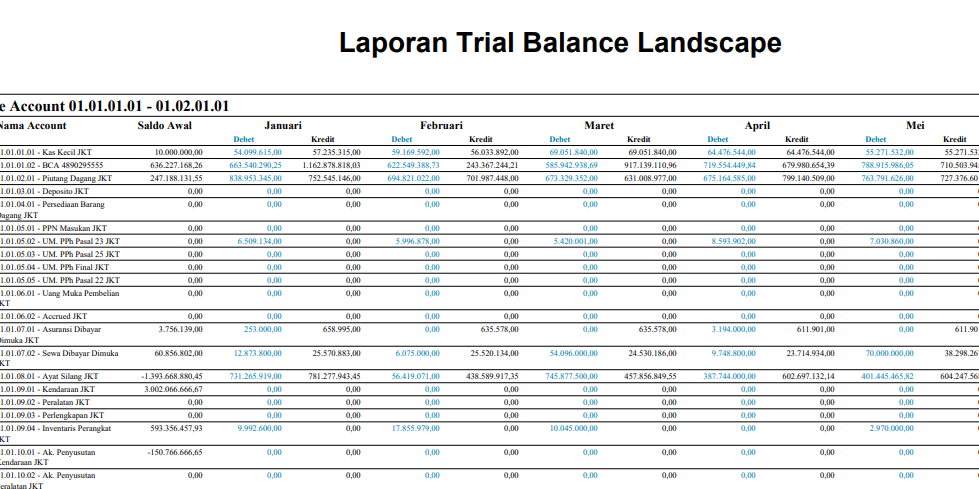
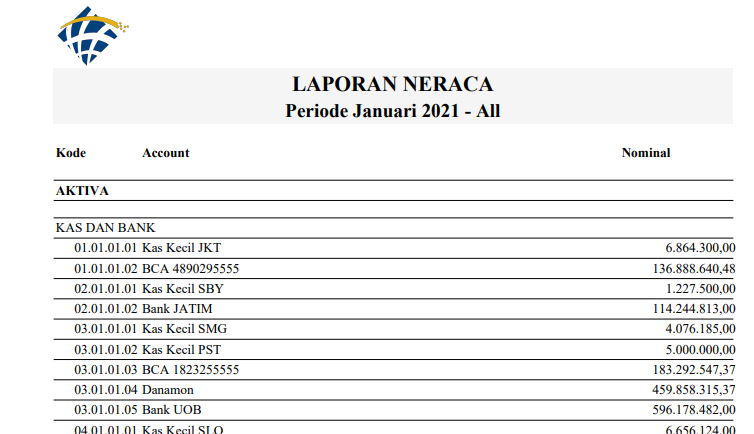

# 1 Dashboard

## 1.1 Import Fix Asset

Program khusus untuk menambahkan fix asset dengan import data type **csv** 

1. Klik Import.  lalu **Download Format** file csv nya . Masukkan data ke file csv.

   

2. Masukkan File yang sudah disiapkan , lalu klik preview

3. Jika Tidak ada yang error , scroll paling bawah klik **import**

4. Setelah itu periksa kembali data apakah sudah sesuai. Lalu Klik **Posting**

5. Data Automatis diproses program untuk di import ke Database **fix_asset dan fa_stok**

## 1.2 Tutup Tahun

Digunakan ketika penjurnalan keuangan tahun yang akan ditutup sudah selesai. Masukkan pin lalu klik **Tutup Tahun**.

## 1.3 Update Data

Digunakan untuk memperbarui data rekap jurnal perbulan. Agar Laporan Jurnal LR dan Neraca data yang ditampilkan dapat diperbarui. Data yang diolah adalah **glj_item** di rekap perbulan , data yang sudah direkap diupdate ke **master_gl** dan **glj_rekap**. Untuk Saldo Awal  diambil dari data **master_gl**

## 1.4 Import Buku Bank

Digunakan untuk import Transaksi Buku Bank yang belum diinput Admin. Daftar Akun yang di input Admin : 

1. Akuntan  & Konsultan : Diinput finance lewat login admin
2. Hutang Dagang : Diinput Admin ketika Pembayaran Tagihan
3. Kas Kecil: Diinput Admin ketika TopUp Petty Cash
4. Piutang Dagang : Diinput admin ketika Pembayaran Invoice
5. Pendapatan Lain2 : Diinput admin di Input Transaksi Bank
6. Uang Muka Penjualan : Diinput Admin di Input Transaksi Bank

Catatan Saat Import Buku Bank :

1. Khusus Akun Koreksi , diubah ke **Piutang Dagang** ketika Import Buku Bank.
2. Khusus Akun Tranfer Antar Bank, yang diinput hanya dari sisi penerima atau kredit.

Cara penggunaanya: 

1. Klik Import.  lalu **Download Format** file csv nya . Masukkan data ke file csv.

   

2. Masukkan File yang sudah disiapkan , lalu klik preview

3. Jika Tidak ada yang error , scroll paling bawah klik **import**. Proses yang terjadi Data tersimpan di **tmp_bank**

4. Setelah itu periksa kembali data apakah sudah sesuai. Lalu Klik **Posting**

5. Data Automatis diproses program untuk di import ke Database **bk_bank , glj, glj_item**. 

# 2 Data Master

## 2.1 Faktur

Lokasi : **Data Master :arrow_right:  Faktur**

Database yag digunakan  : **faktur dan invoice(mengetahui penggunaan faktur terakhir)**

Berisi Data Faktur yang digunakan Untuk Tagihan Invoice Client. Cek Sisa Faktur setiap akan melakukan Invoice-an. 

1. Kode = 1

   Kode Faktur yang sedang digunakan. 

2. Kode = 2

   Kode Faktur ketika Kode faktur yang sedang digunakan habis maka akan berpindah ke kode 2.

## 2.2 GL System

Lokasi : **Data Master :arrow_right:  GL System**

Database yang digunakan : **gl_system**

Berisi Data GL System yang digunakan untuk lock Transaksi Admin seperti tutub bulan dan tutup tahun.

## 2.3 Master Cabang

Lokasi : **Data Master :arrow_right: Master Cabang**

Database yang digunakan : **master_cab**

Berisi daftar cabang yang ada di Datautama. **jika ingin menambahkan Cabang baru maka input juga Master GL , Glink, Master Gudang**.  Cara input sebagai berikut :

1. Mengelola Kode Cabang
2. Nama Pimpinan yang digunakan untuk Cetak Invoice dan Purchase Order
3. Nama Admin yang digunakan untuk Purchase Order
4. Seri adalah Urutan dari Cabang. Jika sekarang terdapat 5 cabang maka no seri Selanjutnya **06**
5. Detail , untuk mengisi detail Informasi Backoffice seperti Rekening Bank dan email digunakan pada cetak Invoice
6. Alamat, digunakan untuk data Alamat di Purchase Order
7. Kunci, merupakan kode [SHA1](https://md5decrypt.net/) yang digunakan untuk keamanan saat ingin membuka laporan teknisi.

## 2.4 Master Client

Lokasi : **Data Master :arrow_right: Master Cabang**

Database yang digunakan : **client**

Berisi Data Client semua Cabang, finance hanya dapat melihat dan mengedit data tersebut. Disarankan untk melihat data saja.

## 2.5 Master GL Account

Lokasi : **Data Master :arrow_right: Master GL Account**

Database yang digunakan : **master_gl**

Berisi daftar akun GL yang digunakan untuk Jurnal Keuangan. Untuk Keterangan Master Gl:

1. Kode Account : Kode Kunci sesuaikan dengan Format Sekarang.
2. Nama Account : Diisi sesuai nama akun
3. Tampil : Jika ingin menampilkan Kode tersebut di Transaksi Bank 
4. Jenis Account : Pilih Jenis Account (Asset, Liability, Incomce, Cost)
5. Kode Kategori : Pilih Kode Kategori sesuaikan dengan Akun GL 
6. Kode Cabang : Pilih Cabang mana yang akan digunakan
7. Saldo Awal  : Tentukan Saldo Awal, Tahun Berjalan. Saldo ini akan mempengaruhi Jurnal Keuangan
8. Kunci Status Bulanan : Digunakan untuk menyembunyikan Akun dari Transaksi Backoffice

## 2.6 Master G-Link

Lokasi : **Data Master :arrow_right: Master G-Link **

Database yang digunakan : **master_glink**

Berisi daftar Link Transaksi Jurnal Backoofice. Finance dapat menambahkan , mengedit dan menghapus Data (Disarankan untuk tidak menghapus dan mengedit data). Link akan berfungsi jika kode program juga diedit.

## 2.7 Master Kategori Account

Lokasi : **Data Master :arrow_right: Master Kategori Account **

Database yang digunakan: **master_ktg**

Berisi Jenis Kategori Account yang digunakan untuk Master GL Account. Finance dapat menambahkan , mengedit dan menghapus Data

## 2.8 Master Supplier

Lokasi  : **Data Master  :arrow_right: Master Supplier  **

Database yang digunakan : **supplierdu**

Finance Bertanggung Jawab Mengelola Data Supplier untuk semua cabang. Cara Pengisian Supplier:

1. Kode Supplier: Penentuan Kode Supplier  3 huruf pertama ditambah 2 angka. Misal **CV AGHNIA JAYA** maka kode nya AGH01, 01 adalah urutan kode , jika AGH01 sudah ada maka diganti menjadi AGH02
2. Status : Jika salah satu cabang masih menggunakan Supplier ini maka Status diisi Aktif
3. Jika Supplierr ber PPN maka pilih Ya pada **PKP**. dan Isi Data Pajak Supplier

# 3 Data Inventory & Inventaris

Berisi Data Master yang berhubungan dengan Inventory dan Inventaris

## 3.1 Master Barang

Lokasi : **Data Inventory & Inventaris :arrow_right: Master Barang**

Database yang digunakan : **i_barang, i_satuan**

Ketentuan input Barang :

1. Kode Barang : Maksimal Input 16 karakter. Kode barang harus unik dan menyerupai nama barang. Diperbolehkan menggunakan Karkater **huruf, angka , simbol (-)** saja.
2. Nama Barang : Maksimal Input 30 karakter
3. Satuan : Untuk Barang menggunakan **pcs** sedangkan kabel menggunakan satuan **box**.
4. Kode Merk : pilih merk , jika merk tidak tersedia input merk terlebih dahulu di [Master Merk](#34-master-merk)
5. Tambahan : Ceklist **PR** jika termasuk Persediaan dan Ceklist **IV** jika termasuk Inventaris

## 3.2 Master Gudang

Lokasi : **Data Inventory & Inventaris :arrow_right: Master Gudang**

Database yang digunakan : **i_master_gudang**

Gudang ditambahkan jika ada Cabang baru atau gudang baru.

## 3.3 Master Jenis Barang

Lokasi : **Data Inventory & Inventaris :arrow_right: Master Jenis Barang**

Database yang digunakan : **i_jenis_barang**

Jenis Barang sudah paten tidak usah diedit , karena dapat mempengaruhi Jurnal Keuangan.

## 3.4 Master Merk

Lokasi : **Data Inventory & Inventaris :arrow_right: Master Merk**

Database yang digunakan : **i_merk**

Finance dapat menambakan merk apabila merk belum tersedia.

# 4 Transaksi Jurnal Accounting

## 4.1 GL Jurnal

Lokasi : **Transaksi Jurnal Accounting :arrow_right: GL Jurnal**

Database yang digunakan : **glj , glj_item**

Digunakan untuk input Jurnal Manual yang tidak terdapat di Modul. Jurnal yang diinput secara manual yaitu **Amortisasi**.

Jenis Jurnal : **AMOR**

Nomor Jurnal : format jenis jurnal 21.07.AMOR04 (Tahun.Bulan.NoUrutCabang)

Data yang dibutuhkan nilai amortisasi bulanan misalkan Cabang Solo Bulan Juli 2021 : 

1. Sewa Gedung : 20.833.333
2. Sewa BTS : 1.240.741
3. Asuransi Kendaraan (Kode Account menggunakan **Premi Asuransi**: 146.535
4. Sewa IP : 641.667
5. Sumbangan & Iuran : 125.000

Jurnal yang terbentuk : 

| Akun                    |      Debet |     Kredit |
| ----------------------- | ---------: | ---------: |
| Sewa Gedung             | 20.833.333 |            |
| Sewa BTS                |  1.240.741 |            |
| Premi Asuransi          |    146.535 |            |
| Asuransi Dibayar Dimuka |            |    146.535 |
| Sewa IP                 |    641.667 |            |
| Sumbangan & Iuran       |    125.000 |            |
| Sewa Dibayar Dimuka     |            | 22.840.741 |

## 4.2 GL Jurnal (ADM)

Lokasi : **Transaksi Jurnal Accounting :arrow_right: GL Jurnal (ADM)**

Database yang digunakan : **glj , glj_item**

Berisi semua jurnal yang telah diinput baik jurnal manual maupun jurnal automatis by program.

## 4.3 Input Buku Bank

Lokasi : **Transaksi Jurnal Accounting :arrow_right: Input Buku Bank**

Database yang digunakan : **bk_bank , glj, glj_item**

Program yang digunakan untuk Mengelola inputan transaksi buku bank.

Jurnal yang terbentuk, contoh jika Bank debet

| Akun                 | Debet | Kredit |
| -------------------- | ----- | ------ |
| Bank                 | 6000  |        |
| Pendapatan Lain Lain |       | 6000   |

## 4.4 Pembeliaan Internal

Lokasi : **Transaksi Jurnal Accounting :arrow_right: Pembeliaan Internal**

Database yang digunakan : **bj_internal, glj , glj_item**

Program untuk menginput Pembeliaan Internal. Berikut cara menginput Pembeliaan Internal :

1. Tanggal : Input kan berdasarkan tanggal akhir dibulan tersebut
2. No Jurnal  : 21.07.ITRL04.19 (Tahun.Bulan.NoUrutCabang.NoUrutPadaCabangTersebut). Untuk Lebih jelas dapat dilihat di File **Maste Input**
3. Pembeliaan Cabang : diisi cabang yang akan membeli, ke cabang yang menjual.
4. Nominal : Lihat Laporan Pembeliaan Internal.

Jenis Jurnal yang digunakan : **ITRL**

Jurnal yang terbentuk, misal pembeliaan Cabang Solo ke Cabang Jakarta

| Akun                         |     Debit |    Kredit |
| ---------------------------- | --------: | --------: |
| Pembeliaan Internal (Solo)   | 2.318.182 |           |
| Ayat Silang SLO (Solo)       |           | 2.318.182 |
| Penjualan Internal (Jakarta) |           | 2.318.182 |
| Ayat Silang JKT (Jakarta)    | 2.318.182 |           |

# 5 Kas Pusat

## 5.1 Input

Lokasi : **Kas Pusat :arrow_right: Input**

Database temporary : **tmp_pcash**

Database yang digunakan : **saldo_pcash, pcash, pcash_item, glj , glj_item**

Jenis Jurnal yang digunakan : **PET-PST** (Petty Cash Pusat)

Tata Cara Input Petty Cash Pusat hampir sama dengan Petty Cash Cabang (Admin),  pembedanya hanyalah memilih cabang ketika input kode.

Jurnal yang terbentuk, misal Uang Makan Karyawan Pusat sebesar 300.000 dibagi 4 Cabang.

| Akun                           |   Debit |  Kredit |
| ------------------------------ | ------: | ------: |
| Uang Makan & Lembur (Jakarta)  |  75.000 |         |
| Uang Makan & Lembur (Surabaya) |  75.000 |         |
| Uang Makan & Lembur (Semarang) |  75.000 |         |
| Uang Makan & Lembur (Solo)     |  75.000 |         |
| Kas Pusat (Semarang)           |         | 300.000 |
| Ayat Silang (Jakarta)          |         |  75.000 |
| Ayat Silang (Surabaya)         |         |  75.000 |
| Ayat Silang (Solo)             |         |  75.000 |
| Ayat Silang (Semarang)         | 225.000 |         |

## 5.2 Top-up

Lokasi : **Kas Pusat :arrow_right: Top-up**

Database yang digunakan : **saldo_pcash, bk_bank, glj , glj_item**

Jenis jurnal yang digunakan : **TOP-PST**

Jurnal yang terbentuk, 

| Akun            |   Debet |  Kredit |
| --------------- | ------: | ------: |
| Kas Kecil Pusat | 100.000 |         |
| Bank            |         | 100.000 |

## 5.3 Cetak Lap. Kas Pusat

Lokasi : **Kas Pusat :arrow_right: Cetak Lap. Kas Pusat**

Database yang digunakan : **pcash , pcash_item**

Berisi Laporan Rekap Petty Cash Pusat ,finance hanya dapat menghapus dan melihat detail laporan.

# 6 Laporan

## 6.1 Transaksi GL Jurnal

Lokasi : **Laporan :arrow_right: Transaksi GL Jurnal**

Database yang digunakan : **glj_item dan glj_item@thn**

File convert excel diambil dari **export/export_jurnal**

File convert pdf diambil dari **tcpdf/cetak/lapcetakgl**

Digunakan untuk menampilkan jurnal pada seluruh transaksi Backoffice dalam bentuk pdf maupun excel.

Untuk bentuk laporannya seperti gambar dibawah ini :

## 6.2 Transaksi Buku Besar

Lokasi : **Laporan :arrow_right: Transaksi Buku Besar**

Database yang digunakan : **glj_item**

File convert pdf diambil dari **tcpdf/cetak/lapcetakbkbesar**

Digunakan untuk cetak pdf jurnal buku besar sesuai COA (Chart Of Account). 

Untuk bentuk laporannya seperti gambar dibawah ini :

## 6.3 Transaksi Buku Besar (Excel)

Lokasi : **Laporan :arrow_right: Transaksi Buku Besar (Excel)**

Database yang digunakan : **glj_item**

File convert excel diambil dari **export/export_bkbesar**

Digunakan untuk cetak excel jurnal buku besar sesuai COA (Chart Of Account). 

Untuk bentuk laporannya seperti gambar dibawah ini :

## 6.4 Transaksi Buku Besar (Ayt)

Lokasi : **Laporan :arrow_right: Transaksi Buku Besar**

Database yang digunakan : **glj_item**

File convert pdf diambil dari **tcpdf/cetak/lapcetakbkbesar1**

Menampilkan jurnal Buku Besar Khusus Ayat Silang dalam bentuk pdf. 

Untuk bentuk laporannya seperti gambar dibawah ini :

## 6.5 Transaksi Trial Balance

Lokasi : **Laporan :arrow_right: Transaksi Trial Balance**

Database yang digunakan : **master_gl**

File convert pdf diambil dari **tcpdf/cetak/lapcetaktrialbalance**

Digunakan untuk cetak pdf jurnal Trial Balance perbulan. sebelum menggunakan harap di update terlebih dahulu.

Untuk bentuk laporannya seperti gambar dibawah ini :

## 6.6 Transaksi Trial Balance (Landscape)

Lokasi : **Laporan :arrow_right: Transaksi Trial Balance (Landscape)**

Database yang digunakan : **master_gl**

File convert pdf diambil dari **tcpdf/cetak/lapcetaktrialbalance2**

Digunakan untuk cetak pdf jurnal Trial Balance 1 Tahun. sebelum menggunakan harap di update gljurnal terlebih dahulu.

Untuk bentuk laporannya seperti gambar dibawah ini :

## 6.7 Laba Rugi Tahunan

Lokasi : **Laporan :arrow_right: Laba Rugi Tahunan**

Database yang digunakan : **master_gl**

File convert pdf diambil dari **tcpdf/cetak/lap_lrthn**

Menyajikan Laporan Laba Rugi 1 Tahun dalam bentuk pdf. Sebelum menggunakan harap di update gljurnal terlebih dahulu.

Untuk bentuk laporannya seperti gambar dibawah ini :

## 6.8 Neraca dan Laba Rugi

Lokasi : **Laporan :arrow_right: Neraca dan Laba Rugi**

Database yang digunakan : **master_gl dan glj_rekap**

File convert pdf diambil dari **tcpdf/cetak/lap_neraca**

Menyajikan Laporan Laba Rugi & Neraca perbulan dalam bentuk pdf. sebelum menggunakan harap di update gljurnal terlebih dahulu.

Untuk bentuk laporannya seperti gambar dibawah ini :

## 6.9 Buku Bank

Lokasi : **Laporan :arrow_right: Buku Bank**

Database yang digunakan : **bk_bank**

File convert excel diambil dari **export/export_bank**

Digunakan untuk melihat daftar transaksi buku bank. Data transaksi dapat diekspor ke excel juga.

Untuk bentuk laporannya seperti gambar dibawah ini :

## 6.10 Saldo

Lokasi : **Laporan :arrow_right: Saldo**

Database yang digunakan : **master_gl dan bk_bank**

Digunakan untuk melihat saldo akhir yang ditentukan pertanggal. 

## 6.11 PPH 23

Lokasi : **Laporan :arrow_right: PPH 23**

Database yang digunakan : **bayar_invoice**

File convert pdf diambil dari **tcpdf/cetak/laporancetakpph23**

Menyajikan laporan pph 23 dari pembayaran invoice client dalam bentuk pdf yang difilter berdasarkan perode tanggal.

Untuk bentuk laporannya seperti gambar dibawah ini :

## 6.12 Invoice Monthly

Lokasi : **Laporan :arrow_right: Invoice Monthly**

Database yang digunakan : **invoice**

File convert pdf diambil dari **tcpdf/cetak/invoice_monthly**

Menyajikan laporan Invoice Monthly dalam bentuk pdf yang difilter berdasarkan bulan.

Untuk bentuk laporannya seperti gambar dibawah ini :

## 6.13 Invoice

Lokasi : **Laporan :arrow_right: Invoice**

Database yang digunakan : **invoice dan invoice_item**

Digunakan untuk melihat laporan invoice dan mengganti no faktur pada invoice. 

# 7 Penyusutan

## 7.1 Penyusutan

Lokasi : **Penyusutan :arrow_right: Penyusutan**

Database yang digunakan : **gl_system , fix_asset , glj_item , glj, tmp_sst**

Digunakan untuk melakukan penyusutan inventaris. Persyaratan sebelum melakukan penyusutan, fix asset sudah terinput semua. Barang yang rusak atau jual maka status diubah terlebih dahulu. Langkah selanjutnya, Ubah bulan dan cabang penyusutan pada **ganti master** lalu klik ganti. Lalu klik susutkan pada **daftar transaksi penyusutan** klik Susutkan. Jika data yang tersusutkan sudah benar maka klik **Simpan** dan apabila data belum sesuai maka klik **Batal** . Untuk mengelola fix asset bisa masuk ke program fix asset

Jurnal yang terbentuk dari penyusutan misal (Cabang Solo April 2021) : 

| Akun                                |         Debet |        Kredit |
| ----------------------------------- | ------------: | ------------: |
| Penyusutan Inventaris Perangkat     | 15.627.499,91 |               |
| Penyusutan Kendaraan                |  2.126.666,66 |               |
| Ak. Penyusutan Inventaris Perangkat |               | 15.627.499,91 |
| Ak. Penyusutan Kendaraan            |               |  2.126.666,66 |

## 7.2 Fix Asset

Lokasi : **Penyusutan :arrow_right: Fix Asset**

Database yang digunakan : **gl_system , fix_asset , glj_item , glj, tmp_sst**

## 7.3 Fix Asset Rusak / Jual

## 7.4 Log Transaksi
